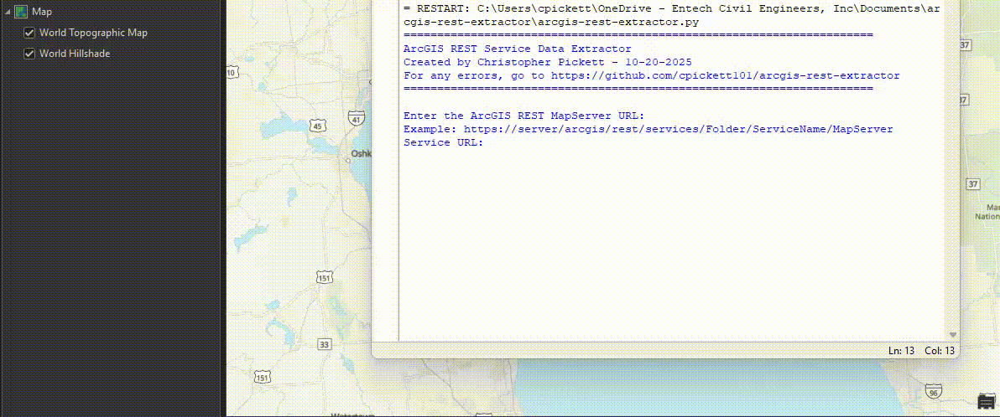

# ArcGIS REST Service Data Extractor

A Python script for extracting data from ArcGIS REST MapServer services into a File Geodatabase using ArcGIS Pro.



*See ArcGIS rest service extractor in action*

## Features

- Interactive command-line interface
- Extract all layers or specific layers by ID
- Preserves geometry types (points, lines, polygons)
- Progress tracking and statistics
- Service validation before extraction
- Comprehensive error handling
- Automatic geodatabase creation

## Requirements

- **ArcGIS Pro 3.3** (or compatible version)
- **Python 3.x** (included with ArcGIS Pro)
- **Required Python Libraries:**
  - `arcpy` (included with ArcGIS Pro)
  - `requests`

## Installation

### Option 1: Clone the Repository

```bash
git clone https://github.com/yourusername/arcgis-rest-extractor.git
cd arcgis-rest-extractor
```

### Option 2: Download ZIP

Download the repository as a ZIP file and extract it to your desired location.

### Install Required Packages

The `requests` library should be included with ArcGIS Pro. If not, install it using the Python Package Manager in ArcGIS Pro or via conda:

```bash
# Using ArcGIS Pro's Python environment
conda activate arcgispro-py3
conda install requests
```

## Usage

### Running the Script

1. **Open ArcGIS Pro**
2. **Open the Python window** (Analysis > Python)
3. **Run the script:**

```python
exec(open(r'C:\path\to\arcgis_rest_extractor.py').read())
```

Or run it directly from the command line using ArcGIS Pro's Python:

```bash
"C:\Program Files\ArcGIS\Pro\bin\Python\envs\arcgispro-py3\python.exe" arcgis_rest_extractor.py
```

### Interactive Prompts

The script will guide you through the following inputs:

1. **Service URL**
   ```
   Example: https://server/arcgis/rest/services/Folder/ServiceName/MapServer
   ```

2. **Output Geodatabase Path**
   ```
   Example: C:\GIS_Data\MyData.gdb
   ```

3. **Extraction Option**
   - Extract all layers
   - Extract specific layers by ID

4. **Layer IDs** (if option 2 selected)
   ```
   Example: 0,5,10,22
   ```

### Example Session

```
======================================================================
ArcGIS REST Service Data Extractor
======================================================================

Enter the ArcGIS REST MapServer URL:
Example: https://server/arcgis/rest/services/Folder/ServiceName/MapServer

Enter the output file geodatabase path:
Output GDB: C:\GIS_Data\MyData.gdb

Do you want to extract:
1. All layers
2. Specific layer(s) by ID
Enter choice (1 or 2): 1

Verifying service URL: 
https://server/arcgis/rest/services/Folder/ServiceName/MapServer
✓ Service accessible: Layers

======================================================================
CONFIGURATION SUMMARY
======================================================================
Service URL: https://server/arcgis/rest/services/Folder/ServiceName/MapServer
Output GDB: C:\GIS_Data\MyData.gdb
Extracting: All layers
======================================================================

Proceed with extraction? (yes/no): yes

======================================================================
STARTING EXTRACTION...
======================================================================

Extracting all 23 layers

[1/23] ============================================================
Layer ID: 0
Layer Name: Data
Output: C:\GIS_Data\MyData.gdb\Data
============================================================
  Querying layer 0...
  ✓ Successfully extracted 150 features
  ✓ Geometry type: esriGeometryPoint

...

======================================================================
EXTRACTION COMPLETE!
======================================================================
✓ Successfully extracted: X layer(s)
📁 Output location: C:\GIS_Data\MyData.gdb
======================================================================
```

## Features Explained

### Service Validation

The script verifies that the ArcGIS REST service is accessible before attempting extraction.

### Geometry Type Preservation

Unlike GeoJSON-based approaches, this script uses Esri JSON format to maintain correct geometry types:
- Points remain points
- Lines remain lines  
- Polygons remain polygons

### Error Handling

- Network timeouts
- Invalid service URLs
- Missing or empty layers
- Invalid layer IDs
- File system errors

### Progress Tracking

Real-time feedback with visual indicators:
- ✓ Success
- ✗ Error
- ⚠ Warning

## Supported Layer Types

- Point layers (esriGeometryPoint)
- Polyline layers (esriGeometryPolyline)
- Polygon layers (esriGeometryPolygon)
- Multi-point layers (esriGeometryMultipoint)

## Troubleshooting

### "Service not accessible" error

- Verify the URL is correct and includes `/MapServer` at the end
- Check your network connection
- Ensure the service is publicly accessible or you have proper authentication

### "No features found" warning

- The layer may be empty
- Check if the layer has a definition query that filters all features
- Verify the spatial reference (2278) is appropriate for your data

### Script hangs or times out

- Large layers may take time to download
- Increase timeout values in the script if needed
- Consider extracting specific layers instead of all layers

### Import Error for `arcpy`

- Ensure you're running the script within ArcGIS Pro's Python environment
- ArcGIS Pro must be installed and licensed

## Configuration Options

You can modify these parameters in the script:

```python
# Timeout for HTTP requests (seconds)
timeout=30

# Output spatial reference
'outSR': '2278'  # Change to your desired WKID

# Query parameters
params = {
    'where': '1=1',  # Modify to filter features
    'outFields': '*',  # Specify fields to extract
    ...
}
```

## Layer ID Reference

To find layer IDs for a service, visit the service's REST endpoint in a web browser:

```
https://your-server/arcgis/rest/services/YourService/MapServer
```

The page will list all layers with their IDs.

## Known Limitations

- Does not support secured services requiring authentication
- Maximum record count limited by server settings (typically 1000-2000)
- Very large datasets may require multiple queries (pagination)
- Does not extract attachments or related tables

## Contributing

Contributions are welcome! Please feel free to submit a Pull Request.

1. Fork the repository
2. Create your feature branch (`git checkout -b feature/AmazingFeature`)
3. Commit your changes (`git commit -m 'Add some AmazingFeature'`)
4. Push to the branch (`git push origin feature/AmazingFeature`)
5. Open a Pull Request

## License

This project is licensed under the MIT License - see the [LICENSE](LICENSE) file for details.

## Acknowledgments

- Built for ArcGIS Pro 3.3
- Uses Esri's REST API specification
- Inspired by the need for simple, reliable data extraction from ArcGIS services

## Author

- GitHub: [@cpickett101](https://github.com/cpickett101)
- Email: christopherbpickett@gmail.com
- LinkedIn: [Christopher Pickett](https://www.linkedin.com/in/christopher-p-a4908979/)

## Support

If you encounter any issues or have questions:
- Open an [issue](https://github.com/cpickett101/arcgis-rest-extractor/issues)
- Check existing issues for solutions
- Refer to the [ArcGIS Pro documentation](https://pro.arcgis.com/en/pro-app/latest/arcpy/)

---

**Note:** This script is designed for extracting data from publicly accessible ArcGIS REST services. For secured services, additional authentication mechanisms would need to be implemented.


